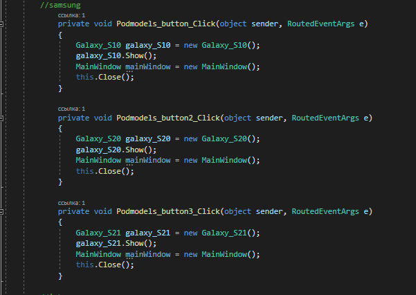
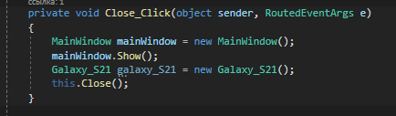

**ЧАСТНОЕ УЧРЕЖДЕНИЕ ДОПОЛНИТЕЛЬНОГО ОБРАЗОВАНИЯ**

**«НОВОСИБИРСКАЯ АКАДЕМИЯ ДИЗАЙНА И ПРОГРАММИРОВАНИЯ»**

**Тема «Разработка ПО на WPF «Смартфоны»»**

Пояснительная записка к дипломному проекту

Выполнил:

Огарков Константин Юрьевич

Преподаватель:

Мухамадиярова Лиана Фанильевна

Новосибирск, 2021

**Оглавление**

[ВВЕДЕНИЕ	3](#_toc71824944)

[2.1 Технические требования	4](#_toc71824945)

[2.2 Основание для разработки	4](#_toc71824946)

[2.3 Назначение разработки	4](#_toc71824947)

[3.1 Ход работы	5](#_toc71824948)

[3.2 Разработка	5](#_toc71824949)

[ЗАКЛЮЧЕНИЕ	12](#_toc71824950)

[Список используемой литературы	17](#_toc71824951)

#

# **ВВЕДЕНИЕ**
Представить мир без мобильной связи уже невозможно. По данным Ассоциации производителей систем сотовых телекоммуникаций, число абонентов мобильной связи ежедневно увеличивается на 46 тысяч человек. Сегодня мобильные телефоны стали предметом первой необходимости. 

Мобильный телефон- это средство связи, которое в наше время есть практически у всех: у детей, подростков, взрослых, пожилых людей. Компании, создающие мобильные телефоны, осваивают новые функции, новые возможности сотового аппарата, представляя новые телефоны с уникальными возможностями. Именно поэтому тема создания приложения для мониторинга информации о смартфонах является актуальной в наше время. 

Цель моей дипломной работы заключается в создании программного обеспечения на WPF “название” для удобного поиска и мониторинга информации. 

Для выполнения данной цели необходимо было выполнить ряд задач:

– поиск информации;

– подбор инструментальных средств для разработки ПО;

– разработка данного ПО;

– тестирование ПО.

**2. ТЕХНИЧЕСКОЕ ЗАДАНИЕ**
# **2.1 Технические требования**
1. ОС от Windows 7 и выше
1. Процессор мощностью 1,6 ГГц и выше
1. Поддерживаемые архитектуры 32-разрядная, 64-разрядная

# **2.2 Основание для разработки**
Основания для проведения разработки: приказ о выполнение дипломной работы от 01.01.2021 года.

Исполнитель: Огарков К.Ю 
# **2.3 Назначение разработки**
Мне требовалось разработать ПО на WPF C# по мониторингу технических качеств и цен мобильных телефонов. Разрабатывалось данное ПО для удобного поиска информации, а именно в сфере коммуникаций мобильной связи. 

В процессе разработки я владел такими навыками как:

– знания языка программирования C#;

–  работа в visual studio;

– правильное использование XML-разметки;

\- умения правильно распределять информацию на форме.

Знания полученные в процессе разработки:

– узнал, как правильно импортировать базу данных в проект;

– научился правильно закрывать процесс работы программы.

**3. ТЕХНОЛОГИЧЕСКИЙ РАЗДЕЛ**
# **3.1 Ход работы**
Для выполнения поставленной задачи, я использовал программу visual studio 2019.

1) Отобрал нужную информацию для ПО
1) Разработал макет интерфейса
1) Подключил логику к программе
# **3.2 Разработка**
Первым этапом были установлены дополнительные модули в Visual Studio. Далее я создал главное окно, сделал разметку на окне и по этой разметке расположил компоненты Button.

Для первого компонента Button был прописан скрипт для открытия 3 кнопок.

При нажатии на одну из этих трёх кнопок, срабатывает скрипт, который прописан для каждой кнопки отдельно.

При срабатывании скрипта, происходит скрытие трёх основных кнопок. Открываются 4 дочерние кнопоки, которые привязаны к данному скрипту.   Результат показан ниже на скриншоте.

В дополнении я создал кнопку “Назад”. Для который был прописан отдельный скрипт. 

Кнопка создана для того, чтобы пользователь при ошибочном нажатии мог вернуться обратно к выбору.

При нажатии на одну из трёх дочерних кнопок, срабатывает скрипт, который закрывает главную форму, открывая новую форму.

Каждая форма была аналогично создана для каждой модели телефона.

7

**Создание дочерней формы**

Первым этапом была создана форма. На форму была размечена разметка. Разметка делилась на наименования и на описания. Наименования были сразу вписаны и размечены по этой разметке.

После чего был добавлен компонент StackPanel. Он был поделён с помощью разметки на строки и столбцы. Это было сделано для удобного размещения информации.

С помощью компонента TextBlock, информация была размечена по определённому столбцу и строке, поделена на характеристики и свойства. 

Также было аналогично сделано, для других столбцов с характеристиками и свойствами. Итог одного из столбцов можно увидеть на скриншоте.

Было создано поле для фотографий, в этом же поле был прописан код на плавную смену с первой фотографии на вторую.

Последним этапом было создание базы данных, база данных была создана в программе Microsoft ACCESS. В базе данных были отражены сайты магазинов и стоимость на этих сайтах товара.

Для подключения базы данных была прописана команда в главной форме. Которая отвечала за путь и само подключение к программе БД.

На дочернюю форму была добавлена таблица с текстом, который был вписан изначально в ACESS.

Итог таблицы на дочерней форме можно увидеть на скриншоте ниже.

Также при добавлении базы данных на форму, был автоматически создан код для заполнения базы данных. Он отвечает за то, чтобы наша таблица брала автоматически данные из программы ACCESS.

`	`Для возвращении назад на главную форму. Была создана отдельная кнопка на дочерней форме.

`	`Для неё был прописан скрипт, который закрывал дочернею форму и открывал основную.

Как итог у нас получилась дочерняя форма, полностью заполненная информацией. Скриншот этой форме можно увидеть ниже.

Аналогично были созданы и заполнены остальные 8 дочерних форм.

# **ЗАКЛЮЧЕНИЕ**

Во время написания дипломной работы, я подкрепил полученные во время учебы практические и теоретические навыки, расширил свои знания в области информационных систем, а именно в программировании на C# WPF в Visual Studio.

При написании дипломной работы особо ценными оказались знания, полученные при изучении таких тем как C# WPF, C# абстракция, интерфейсы, C# методы.

В заключении хочу сказать, что основная цель работы была выполнена, поставленные задачи были решены. Во время разработки столкнулся со следующими трудностями:

– процесс работы не завершался при выходе;

– изначально планировалось внедрить парсеры в проект, но решил сделать альтернативу при помощи базы данных Access.

При тестировании приложения ошибок не обнаружено, данный проект работает исправно. 

В дальнейшим проект будет дорабатываться, и я хочу его продвигать при помощи веб-сервиса GitHub.

ПРИЛОЖЕНИЕ №1

using System;

using System.Collections.Generic;

using System.Linq;

using System.Text;

using System.Threading.Tasks;

using System.Windows;

using System.Windows.Controls;

using System.Windows.Data;

using System.Windows.Documents;

using System.Windows.Input;

using System.Windows.Media;

using System.Windows.Media.Imaging;

using System.Windows.Navigation;

using System.Windows.Shapes;

using System.Data.OleDb;

namespace text

{

`    `/// 

`    `/// Логика взаимодействия для MainWindow.xaml

`    `/// 

`    `public partial class MainWindow : Window

`    `{

`        `public MainWindow()

`        `{

`            `InitializeComponent();

`        `}

`        `public string connection = @"Provider=Microsoft.ACE.OLEDB.12.0; Data Source=C:\Users\Учителя\Desktop\Новая папка (5)\Новая папка (3)\Диплом\Base\Price123456.accdb";

`        `public OleDbDataReader Select(string selectSQL)

`        `{

`            `OleDbConnection connect = new OleDbConnection(connection);

`            `connect.Open();

`            `OleDbCommand cmd = new OleDbCommand(selectSQL, connect);

`            `OleDbDataReader reader = cmd.ExecuteReader();

`            `return reader;

`        `}

`        `public void telefon\_Click(object sender, RoutedEventArgs e)

`        `{

`            `models\_button.Visibility = Visibility.Visible;

`            `models\_button2.Visibility = Visibility.Visible;

`            `models\_button3.Visibility = Visibility.Visible;

`        `}

`        `private void models\_button\_Click(object sender, RoutedEventArgs e)

`        `{

`            `models\_button.Visibility = Visibility.Hidden;

`            `models\_button2.Visibility = Visibility.Hidden;

`            `models\_button3.Visibility = Visibility.Hidden;

`            `Podmodels\_button.Visibility = Visibility.Visible;

`            `Podmodels\_button2.Visibility = Visibility.Visible;

`            `Podmodels\_button3.Visibility = Visibility.Visible;

`            `Return.Visibility = Visibility.Visible;

`        `}

`        `private void models\_button2\_Click(object sender, RoutedEventArgs e)

`        `{

`            `models\_button.Visibility = Visibility.Hidden;

`            `models\_button2.Visibility = Visibility.Hidden;

`            `models\_button3.Visibility = Visibility.Hidden;

`            `Podmodels2\_button.Visibility = Visibility.Visible;

`            `Podmodels2\_button2.Visibility = Visibility.Visible;

`            `Podmodels2\_button3.Visibility = Visibility.Visible;

`            `Return2.Visibility = Visibility.Visible;

`        `}

`        `private void models\_button3\_Click(object sender, RoutedEventArgs e)

`        `{

`            `models\_button.Visibility = Visibility.Hidden;

`            `models\_button2.Visibility = Visibility.Hidden;

`            `models\_button3.Visibility = Visibility.Hidden;

`            `Podmodels3\_button.Visibility = Visibility.Visible;

`            `Podmodels3\_button2.Visibility = Visibility.Visible;

`            `Podmodels3\_button3.Visibility = Visibility.Visible;

`            `Return3.Visibility = Visibility.Visible;

`        `}

`        `//назад

`            `private void Return\_Click(object sender, RoutedEventArgs e)

`            `{

`                `models\_button.Visibility = Visibility.Visible;

`                `models\_button2.Visibility = Visibility.Visible;

`                `models\_button3.Visibility = Visibility.Visible;

`                `Podmodels\_button.Visibility = Visibility.Hidden;

`                `Podmodels\_button2.Visibility = Visibility.Hidden;

`                `Podmodels\_button3.Visibility = Visibility.Hidden;

`                `Return.Visibility = Visibility.Hidden;

`            `}

`            `private void Return2\_Click(object sender, RoutedEventArgs e)

`            `{

`                `models\_button.Visibility = Visibility.Visible;

`                `models\_button2.Visibility = Visibility.Visible;

`                `models\_button3.Visibility = Visibility.Visible;

`                `Podmodels2\_button.Visibility = Visibility.Hidden;

`                `Podmodels2\_button2.Visibility = Visibility.Hidden;

`                `Podmodels2\_button3.Visibility = Visibility.Hidden;

`                `Return2.Visibility = Visibility.Hidden;

`            `}

`            `private void Return3\_Click(object sender, RoutedEventArgs e)

`            `{

`                `models\_button.Visibility = Visibility.Visible;

`                `models\_button2.Visibility = Visibility.Visible;

`                `models\_button3.Visibility = Visibility.Visible;

`                `Podmodels3\_button.Visibility = Visibility.Hidden;

`                `Podmodels3\_button2.Visibility = Visibility.Hidden;

`                `Podmodels3\_button3.Visibility = Visibility.Hidden;

`                `Return3.Visibility = Visibility.Hidden;

`            `}

`        `//samsung

`            `private void Podmodels\_button\_Click(object sender, RoutedEventArgs e)

`            `{

`                `Galaxy\_S10 galaxy\_S10 = new Galaxy\_S10();

`                `galaxy\_S10.Show();

`                `MainWindow mainWindow = new MainWindow();

`                `this.Close();

`            `}

`            `private void Podmodels\_button2\_Click(object sender, RoutedEventArgs e)

`            `{

`                `Galaxy\_S20 galaxy\_S20 = new Galaxy\_S20();

`                `galaxy\_S20.Show();

`                `MainWindow mainWindow = new MainWindow();

`                `this.Close();

`            `}

`            `private void Podmodels\_button3\_Click(object sender, RoutedEventArgs e)

`            `{

`                `Galaxy\_S21 galaxy\_S21 = new Galaxy\_S21();

`                `galaxy\_S21.Show();

`                `MainWindow mainWindow = new MainWindow();

`                `this.Close();

`            `}

`        `//iphone

`            `private void Podmodels2\_button\_Click(object sender, RoutedEventArgs e)

`            `{

`                `iPhone\_XR iphone\_XR = new iPhone\_XR();

`                `iphone\_XR.Show();

`                `MainWindow mainWindow = new MainWindow();

`            `Application.Current.ShutdownMode = ShutdownMode.OnLastWindowClose;

`            `this.Close();

`        `}

`           `private void Podmodels2\_button2\_Click(object sender, RoutedEventArgs e)

`            `{

`                 `this.Hide();

`                `iPhone\_11 iphone\_11 = new iPhone\_11();

`                `iphone\_11.Show();

`            `}

`            `private void Podmodels2\_button3\_Click(object sender, RoutedEventArgs e)

`            `{

`                `iPhone\_12 iphone\_12 = new iPhone\_12();

`                `iphone\_12.Show();

`                `MainWindow mainWindow = new MainWindow();

`                `this.Close();

`            `}

`        `//Huawei

`            `private void Podmodels3\_button\_Click(object sender, RoutedEventArgs e)

`            `{

`                `Huawei\_P40 huawei\_P40 = new Huawei\_P40();

`                `huawei\_P40.Show();

`                `MainWindow mainWindow = new MainWindow();

`                `this.Close();

`            `}

`            `private void Podmodels3\_button2\_Click(object sender, RoutedEventArgs e)

`            `{

`                `Huawei\_P\_smart huawei\_P\_Smart = new Huawei\_P\_smart();

`                `huawei\_P\_Smart.Show();

`                `MainWindow mainWindow = new MainWindow();

`                `this.Close();

`            `}

`            `private void Podmodels3\_button3\_Click(object sender, RoutedEventArgs e)

`            `{

`                `Huawei\_Y8P huawei\_Y8P = new Huawei\_Y8P();

`                `huawei\_Y8P.Show();

`                `MainWindow mainWindow = new MainWindow();

`                `this.Close();

`            `}

`    `}

}

ПРИЛОЖЕНИЕ №2

using System;

using System.Collections.Generic;

using System.Linq;

using System.Text;

using System.Threading.Tasks;

using System.Windows;

using System.Windows.Controls;

using System.Windows.Data;

using System.Windows.Documents;

using System.Windows.Input;

using System.Windows.Media;

using System.Windows.Media.Imaging;

using System.Windows.Shapes;

using System.Data.OleDb;

namespace text

{

`    `/// 

`    `/// Логика взаимодействия для iPhone\_XR.xaml

`    `/// 

`    `public partial class iPhone\_XR : Window

`    `{

`        `public iPhone\_XR()

`        `{

`            `InitializeComponent();

`        `}

`        `private void Close\_Click(object sender, RoutedEventArgs e)

`        `{

`            `MainWindow mainWindow = new MainWindow();

`            `mainWindow.Show();

`            `iPhone\_XR iphone\_XR = new iPhone\_XR();

`            `this.Close();

`        `}

`        `protected override void OnClosed(EventArgs e)

`        `{

`            `base.OnClosed(e);

`        `}

`        `private void Window\_Loaded\_1(object sender, RoutedEventArgs e)

`        `{

`            `text.Price123456DataSet price123456DataSet = ((text.Price123456DataSet)(this.FindResource("price123456DataSet")));

`            `// Загрузить данные в таблицу iPhone\_XR. Можно изменить этот код как требуется.

`            `text.Price123456DataSetTableAdapters.iPhone\_XRTableAdapter price123456DataSetiPhone\_XRTableAdapter = new text.Price123456DataSetTableAdapters.iPhone\_XRTableAdapter();

`            `price123456DataSetiPhone\_XRTableAdapter.Fill(price123456DataSet.iPhone\_XR);

`            `System.Windows.Data.CollectionViewSource iPhone\_XRViewSource1 = ((System.Windows.Data.CollectionViewSource)(this.FindResource("iPhone\_XRViewSource1")));

`            `iPhone\_XRViewSource1.View.MoveCurrentToFirst();

`        `}

`    `}

}

# **Список используемой литературы**
1. WPF закрытие окон [Электронный ресурс] URL: <http://coderoad.ru/9992119/WPF> 
1. ` `Подключение к данным в базе данных Access [Электронный ресурс] URL: <http://docs.microsof.com/ru-ru/visualstudio/data-in-an-access> 
1. WPF и база данных Access [Электронный ресурс] URL: http://www.cyberforum.ru/wpf-silverlight/thread35398.html 
1. Быстрый старт с WPF [Электронный ресурс] URL: <http://m.habr.com/ru/post/427325/>
1. Window Presentation Foundation [Электронный ресурс] URL: http://ru.m/wikipedia.org./wiki/Windows\_Presentaton\_Foundation 

